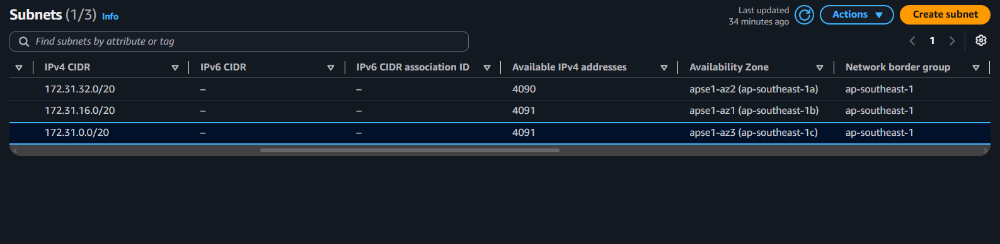
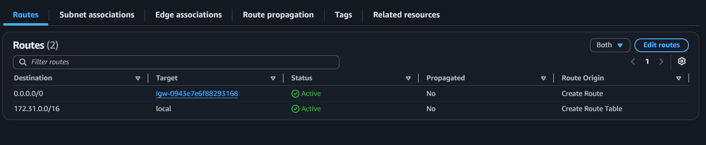
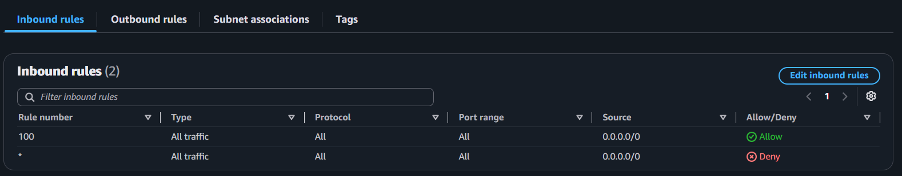
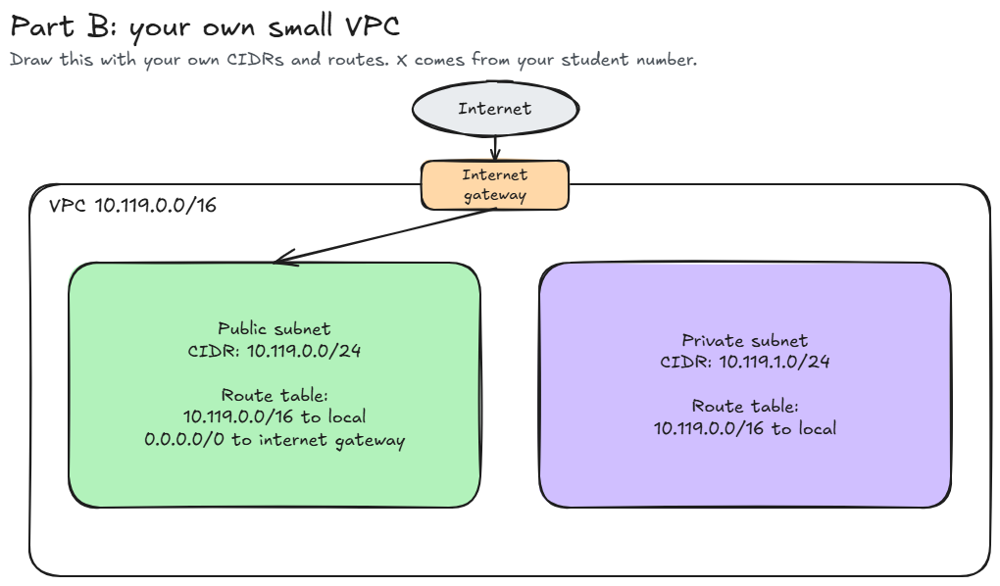

# Assignment 2 Submission

## About me

- GitHub username: keiameere
- Section: ccsad
- IAM user name that I signed in with: ccsad-g06
- X: 119

---

## Part A. Explore

### A1. The VPC

Default VPC IPv4 CIDR:

'172.31.0.0/16'

Number of addresses in that CIDR:

65,536

### A2. The subnets

| Availability Zone | IPv4 CIDR |
| --- | --- |
| apse1-az2 (ap-southeast-1a) | 172.31.32.0/20 |
| apse1-az2 (ap-southeast-1b) | 172.31.16.0/20 |
| apse1-az2 (ap-southeast-1c) | 172.31.0.0/20 |

### A3. Available addresses

Available IPv4 addresses in each subnet:

`ap-southeast-1a` 4,090, `ap-southeast-1b` 4,091, `ap-southeast-1c` 4,091.

Why is the number lower than 4,096?

'AWS reserves 5 addresses in every subnet: the network address, VPC router, DNS server, one for future use, and the broadcast address. So 4,096 − 5 = 4,091.'

What uses the missing address in the subnet with the lowest number?

'One IP in 172.31.32.0/20 (ap-southeast-1a) is in use by a network interface (ENI). That's usually an EC2 instance, or a service-managed ENI (load balancer, NAT gateway, RDS, VPC endpoint, etc.).'

### A4. The route table

| Destination | Target |
| --- | --- |
| 0.0.0.0/0 | igw-0943e7e6f88293168 |
| 172.31.0.0/16 | local |

### A5. Public or private

Are the default subnets public or private? Which route proves it?

'0.0.0.0/0 - igw-0943e7e6f88293168 (Active). It sends all non-local traffic to an Internet Gateway, which is what makes a subnet public.'

### A6. The internet gateway

State of the internet gateway:

'Attached'

What happens to the default subnets if the gateway is detached?

'They lose internet connectivity. Instances in those subnets can't reach the internet, and the internet can't reach them even if they have public IPs.'

### A7. NAT gateways

Number of NAT gateways:

'0'

Can a server in a new private subnet download updates? Why?

'No. A private subnet has no route to the internet. A truly private subnet would use a separate route table with only the local route, so nothing can leave the VPC. Even if it did use the IGW route, a server with only a private IP can't use an Internet Gateway, since the IGW only translates for instances that have a public/Elastic IP.'

### A8. The network ACL

| Rule number | Source | Allow or Deny |
| --- | --- | --- |
| 100 | 0.0.0.0/0 | Allow |
| * | 0.0.0.0/0 | Deny |

How is a network ACL different from a security group?

'A network ACL works at the subnet level, is stateless, and has numbered Allow and Deny rules evaluated in order. A security group works at the instance (ENI) level, is stateful, and has Allow rules only.'

### A9. The default security group

Inbound rule (type and source):

'All traffic, sg-0c5b6d4081cf0a534 - default'

Which resources can send traffic to an instance that uses it?

'Only resources that are members of this same default security group. Since the source is the group itself rather than an IP range, nothing outside the group can reach the instance, including the internet. The only exception is return traffic for connections the instance started, which is allowed automatically because security groups are stateful.'

---

## Part B. Prepare

### B1. Plan two subnets

- Public subnet CIDR: 10.119.0.0/24
- Private subnet CIDR: 10.119.1.0/24

### B2. Route tables

Route table of the public subnet:

| Destination | Target |
| --- | --- |
| 10.119.0.0/16 | local |
| 0.0.0.0/0 | internet gateway |

Route table of the private subnet:

| Destination | Target |
| --- | --- |
| 10.119.0.0/16 | local |

### B3. My VPC diagram

Tool used (Excalidraw, draw.io, Lucidchart, or paper):

'Excalidraw'

### B4. Predict a change

Can you still open the web page from your laptop? Why?

No. Without the `0.0.0.0/0 → internet gateway` route, the subnet has no path to the internet. My request may reach the instance, but the reply cannot be sent back to my laptop, so the page does not load.

Can the instance still reach another instance in the VPC? Why?

Yes. Traffic inside the VPC uses the separate `172.31.0.0/16 → local` route, which is not affected by deleting `0.0.0.0/0`. This works as long as the security groups and network ACLs allow the traffic.

### B5. Place a database

Which subnet gets the database? Why?

The private subnet (`10.119.1.0/24`). Its route table has no route to the internet gateway, so the database cannot be reached directly from the internet. Only resources inside the VPC, such as the web server in the public subnet, can connect to it through the `local` route.

### B6. My question about VPCs

What is your question, and what made you think of it?

If a subnet exists in only one Availability Zone, what happens to my database in the private subnet if that AZ fails, and how should I design the VPC to survive it? I think of this because in Part A each default subnet was tied to one AZ, and my plan shows only one public and one private subnet.