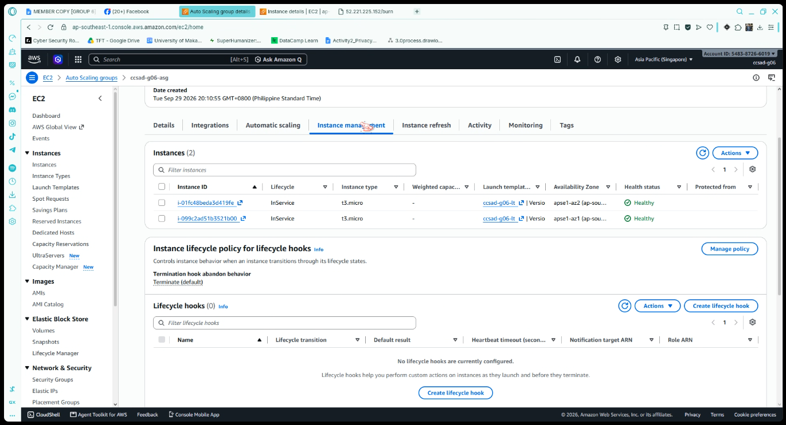
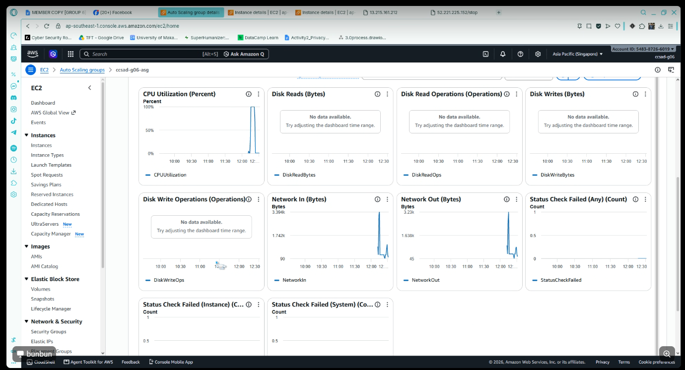

# Lab 2 Submission

## Instance Tracking
**First Instance**
- Instance ID: i-01fc48beda3d419fe
- Availability Zone: ap-southeast-1a

**Second Instance**
- Instance ID: i-099c2ad51b3521b00
- Availability Zone: ap-southeast-1b

## Proof (Screenshots)
1. **Activity History:** 
   
   

2. **CloudWatch Alarm:** 

   

## Questions
1. Why did the group stop at 2 instances?
   The Maximum capacity was set to 2 in Step 4. The target tracking policy kept asking for more instances while CPU stayed above 40%, but the group cannot go past its maximum. This ceiling also caps the cost, no matter how heavy the load gets.
2. Why did terminating an instance by hand not remove the cost?
   The group is set to keep a desired number of instances. When you terminated one, the group saw the count drop below that number and launched a replacement right away. So you still had the same number of instances running and paying. The cost only stops when you delete the group itself, which is why Step 7 removes the Auto Scaling group first.
3. Why is the target value set to your assigned value (e.g., 30-85 percent) instead of 99 percent?
   A new instance needs time to launch, boot, run the user data, and finish the 60-second warmup before it can help. At 90%, the current instance would already be overloaded before the new one is ready. At 40%, the group scales out early, while the existing instance can still serve requests. A lower target also makes the lab work in class, since a t3.micro under /burn crosses 40% quickly. The trade-off is that a lower target keeps more spare capacity, which costs more.
4. What did the automatic cutoff protect us from?
   It protected us from forgotten resources running up charges. Scale-in waits about fifteen minutes of low CPU, so without the cutoff the group would keep running after class and would keep replacing any instance that was terminated. A student who forgot Step 7 would keep paying for instances, detailed monitoring, and public IPs. The cutoff ends the group first, so a mistake does not turn into an open-ended bill.
5. What changes when a load balancer sits in front of the group?
   Users reach the group through one stable address instead of each instance's public IP. Requests are shared across all healthy instances, so the load is spread out instead of hitting one machine. The group can also use load balancer health checks, so an instance that is running but not serving web pages gets replaced. New instances are added only when ready, and the instances can move to private subnets. The downside is that the load balancer has its own hourly and usage charges.
`